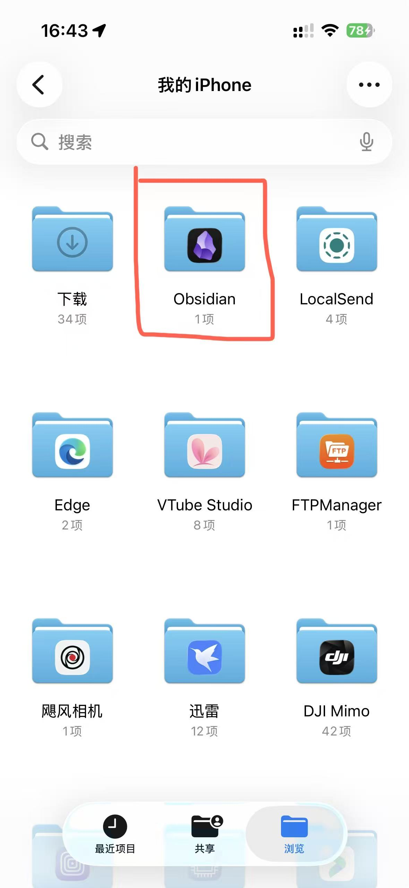
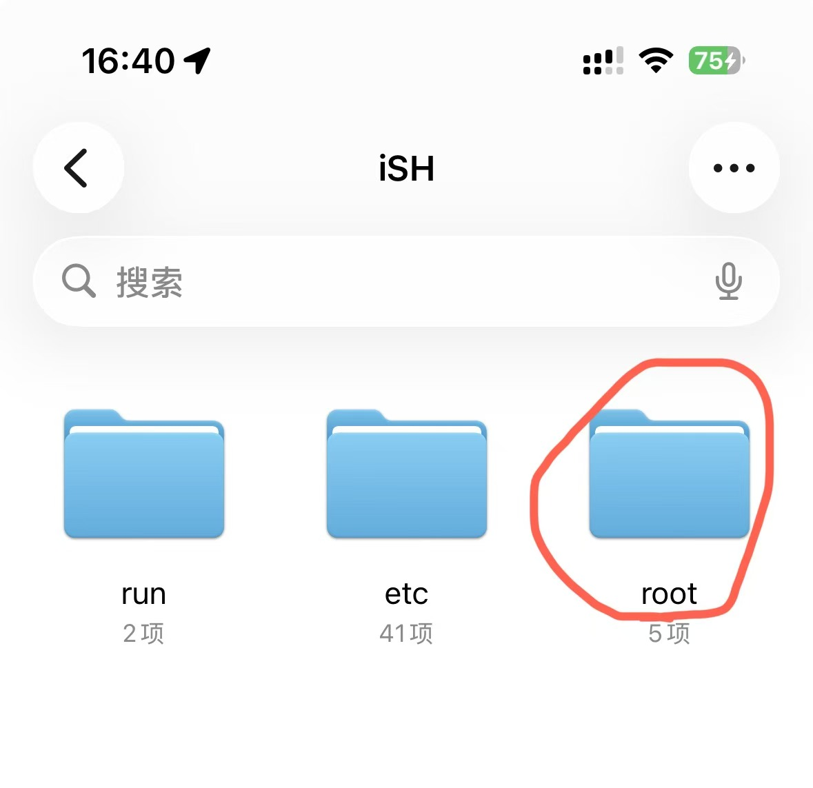

#  前言
由于iOS上的git软件要不然是付费，要不然是不好用，而大家推荐的 `Working Copy` 买断价128元，这着实令人望而却步。而本教程提供了一种免费的git同步方式，使用了 `iSH` 这款开源软件， **另外我更愿意把git同步交给开源软件，而不是`Working Copy`这样的付费软件。** 
# 准备工作
1. ios手机或者ipad一部，appstore下载安装iSH和Obsidian
2. 打开iSH，进行初始更新 `apk update`
3. 安装好以下软件：git、vim、openssh `apk add 软件名`
4. 打开Obsidian创建仓库，例如命名为fuwari，关闭icloud同步
5. 创建好git平台账号，并创建仓库，例如名为fuwari，复制出ssh地址
# iSH操作
1. 设置和托管平台一致的用户名 `git config --global user.name "你注册GitHub账号的名字"` 
2. 设置和平台一致的邮箱 `git config --global user.email "你注册GitHub账号用的邮箱"` 
3. 生成公钥 `ssh-keygen -t rsa -C ‘上面的邮箱’` ,接着按3个回车
	1. 最后在.ssh目录下（root文件夹下，但是iOS文件管理看不到隐藏文件夹）得到了两个文件：id_rsa（私有秘钥）和id_rsa.pub（公有密钥）
4. 再次查看显示公钥 `cat ~/.ssh/id_rsa.pub` 
5. 选中公钥文本进行复制操作
6. 配置公钥至github [配置地址]((https://github.com/settings/keys) 
	1. `Title` 随便取一个名字，如：key
	2. `Key type` 选择 `Authentication Key` 
	3. `Key` 中粘贴刚刚复制的公钥
	4. 最后 `Add SSH key` 即可
7. 选择手机本地obsidian文件夹装载到ish上。 
	1. `mount -t ios . obsidian` 然后在弹出的窗口中打开 **我的 iPhone** / **我的iPad** ，选择**Obsidian** 文件夹（有Obsidian图标的那个），点击打开
		
8. 进入fuwari文件夹内克隆远程仓库
	1. 去你的github 仓库中找到ssh clone地址
	2. 在iSH中 `cd obsidian`
	3. 删除原来的fuwari文件夹 `rm -f fuwari`
	4. 克隆远程仓库 `git clone 你的远程仓库ssh地址`
9. 禁用安全目录`git config --global --add safe.directory /root/obsidian/fuwari`
# 打开Obsidian就能开始写作了
# 同步与更新循环步骤：

1. 打开iSH后，进入你的fuwari文件夹 `cd obsidian/fuwari`
2. 先进行拉取 `git pull`
3. 进行笔记的编辑与修改。
4. 将修改添加到缓存区 `git add .`
5. 添加这次提交的备注信息 `git commit -m '新添加的文件内容描述'`
6. 推送到平台上 `git push`
# 其他注意事项
## 如果已经有了ssh公钥私钥怎么办
1. 现将你的公钥和私钥拷贝到iSH的root文件夹
	1. 
	2. 
2. 移动你的密钥到 `.ssh` 文件夹中即可（mv 指令）
## 删除iSH的obsidian文件前请先卸载obsidian   
# 结语
这个方案最大的优点是免费，缺点是必须懂git和linux。因为所有的操作都是通过命令行实施，包括后续的文档内容更新。但是可玩性很大，这个 `alpine` 环境还挺好用的