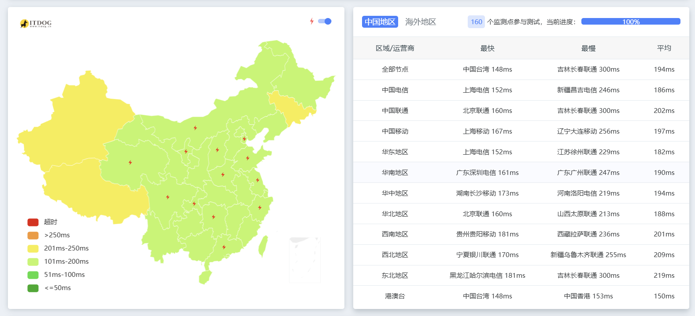

# 机器配置
配置如图，实付款124¥（提交购买之后会有个抽奖减钱的），平均每月就10块多一点，性价比还是很高的。[活动页面](https://www.racknerd.com/BlackFriday/) *(可能需要科学才能加载出页面)* [同配置直接购买链接](https://my.racknerd.com/cart.php?a=confproduct&i=0))
机房我选择的洛杉矶DC02机房，全国延迟表现还可以， `itdog` 测试如下：

由于写作时间为晚高峰，部分地区延迟较高，具体线路可看下面的报告。
# 💻基本信息

```

Basic System Information:

---------------------------------

Uptime     : 0 days, 0 hours, 44 minutes

Processor  : Intel(R) Xeon(R) CPU E5-2697 v2 @ 2.70GHz

CPU cores  : 2 @ 2699.998 MHz

AES-NI     : ✔ Enabled

VM-x/AMD-V : ❌ Disabled

RAM        : 2.4 GiB

Swap       : 1.2 GiB

Disk       : 46.0 GiB

Distro     : Debian GNU/Linux 12 (bookworm)

Kernel     : 6.8.0-31-generic

VM Type    : KVM

IPv4/IPv6  : ✔ Online / ✔ Online

  

IPv6 Network Information:

---------------------------------

ISP        : Multacom Corporation

ASN        : AS35916 MULTACOM CORPORATION

Host       : Multacom Corporation

Location   : Los Angeles, California (CA)

Country    : United States

  

fio Disk Speed Tests (Mixed R/W 50/50) (Partition -):

---------------------------------

Block Size | 4k            (IOPS) | 64k           (IOPS)

  ------   | ---            ----  | ----           ----

Read       | 65.47 MB/s   (16.3k) | 1.02 GB/s    (16.0k)

Write      | 65.60 MB/s   (16.4k) | 1.02 GB/s    (16.0k)

Total      | 131.07 MB/s  (32.7k) | 2.05 GB/s    (32.0k)

           |                      |                    

Block Size | 512k          (IOPS) | 1m            (IOPS)

  ------   | ---            ----  | ----           ----

Read       | 1.51 GB/s     (2.9k) | 1.56 GB/s     (1.5k)

Write      | 1.59 GB/s     (3.1k) | 1.67 GB/s     (1.6k)

Total      | 3.11 GB/s     (6.0k) | 3.23 GB/s     (3.1k)

  

Geekbench 5 Benchmark Test:

---------------------------------

Test            | Value                        

                |                              

Single Core     | 706                          

Multi Core      | 1374                          

Full Test       | https://browser.geekbench.com/v5/cpu/23933181

  

 SysBench CPU 测试 (Fast Mode, 1-Pass @ 5sec)

---------------------------------

 1 线程测试(单核)得分:          941 Scores

 2 线程测试(多核)得分:          1804 Scores

 SysBench 内存测试 (Fast Mode, 1-Pass @ 5sec)

---------------------------------

 单线程读测试:          18543.76 MB/s

 单线程写测试:          17268.75 MB/s

```

# 🎬IP质量

 

  

# 🌐网络质量

 

  

# 📍回程路由

 

  
  

[NodeQuality链接](https://nodequality.com/r/3RqlfOVAbdmy3nZiMN79ZuTigqOJmxCi)